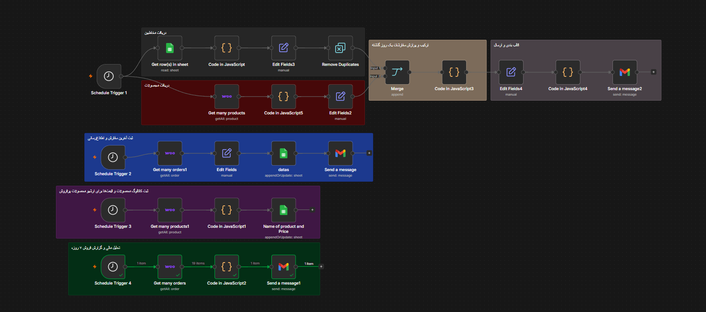

<div dir="rtl">

<h1 align="center">🛒 اتوماسیون هوشمند بازاریابی، فروش و گزارش‌دهی ووکامرس</h1>

<p align="center">
  📊 یک سیستم جامع و چندمنظوره برای فروشگاه‌های ووکامرس که با ترکیب <b>هوش مصنوعی، پایگاه داده و اتوماسیون</b>، فرآیندهای بازاریابی، ثبت سفارش، آرشیو محصولات و گزارش‌دهی مالی را به‌صورت خودکار مدیریت می‌کند.
</p>

<p align="center">
  <b>✅ ارسال خبرنامهٔ شخصی‌سازی‌شده • ✅ ثبت خودکار سفارشات • ✅ آرشیو محصولات و قیمت‌ها • ✅ گزارش فروش هفتگی</b>
</p>

---

## 🎬 دموی کامل فرآیند (چهار سناریوی اتوماسیون در یک ورکفلو)

<p align="center">
  <a href="https://github.com/user-attachments/assets/f2523c86-7d15-4403-9ab5-079df0b62345">
  </a>
</p>

<p align="center">
  <video src="https://github.com/user-attachments/assets/f2523c86-7d15-4403-9ab5-079df0b62345" controls width="800">
    مرورگر شما از پخش ویدیو پشتیبانی نمی‌کند.
  </video>
</p>

> 🔄 در این ویدیو مشاهده می‌کنید که چگونه چهار سناریوی اتوماسیون در یک ورکفلو اجرا می‌شوند: ارسال خبرنامه به مشتریان بر اساس علاقه‌مندی، ثبت سفارشات جدید، آرشیو قیمت‌ها و گزارش فروش هفتگی.

---

## 🧩 معماری ورکفلو (ساختار گره‌ها در n8n)




> 📌 این تصویر، معماری چندمسیرهٔ این پروژه را نشان می‌دهد: **۴ تریگر زمان‌بندی‌شده** که هرکدام یک سناریوی مجزا را اجرا می‌کنند، اما داده‌ها و منطق آن‌ها در یک ساختار یکپارچه مدیریت می‌شود.

---

## 🎯 این پروژه دقیقاً چه مشکلی را حل می‌کند؟

مدیریت یک فروشگاه ووکامرس شامل چندین فرآیند تکراری و زمان‌بر است: ارسال خبرنامه به مشتریان، ثبت و پیگیری سفارشات، به‌روزرسانی کاتالوگ قیمت‌ها و تولید گزارش‌های فروش. انجام دستی این کارها هم هزینه‌بر است و هم احتمال خطا را افزایش می‌دهد.

**این پروژه با ترکیب ۴ سناریوی مجزا در یک ورکفلو، تمام این فرآیندها را به‌صورت خودکار مدیریت می‌کند:**

---

### سناریو ۱: ارسال خبرنامهٔ شخصی‌سازی‌شده (Marketing Automation)

**📋 مشکل:** ارسال پیام‌های عمومی به همهٔ مشتریان، نرخ تبدیل پایینی دارد و مشتریان به پیام‌های غیرمرتبط بی‌توجه می‌شوند.

**✅ راه‌حل این پروژه:**
۱. **📊 دریافت لیست مشتریان از گوگل شیت:** اطلاعات مشتریان (نام، ایمیل، علاقه‌مندی) خوانده می‌شود.
۲. **🧹 فیلتر و یکسان‌سازی:** ایمیل‌های نامعتبر حذف و رکوردهای تکراری پاک‌سازی می‌شوند.
۳. **🛍️ دریافت محصولات جدید از ووکامرس:** محصولات ۲۴ ساعت گذشته از فروشگاه دریافت می‌شوند.
۴. **🧠 تطبیق هوشمند علاقه‌مندی با محصولات:** با استفاده از یک `Code (JavaScript)`، دسته‌بندی علاقه‌مندی هر کاربر با دسته‌بندی محصولات جدید تطبیق داده می‌شود.
۵. **📧 تولید ایمیل شخصی‌سازی‌شده:** برای هر کاربر، یک ایمیل HTML حاوی محصولات جدید مرتبط با علاقه‌مندی او تولید می‌شود.
۶. **📤 ارسال از طریق Gmail:** هر ایمیل به‌صورت جداگانه و شخصی‌سازی‌شده ارسال می‌شود.

> 💡 **نکته فنی برجسته:** این سناریو از `Remove Duplicates` و فیلترهای هوشمند برای جلوگیری از ارسال ایمیل‌های تکراری و تضمین کیفیت داده‌ها استفاده می‌کند.

---

### سناریو ۲: ثبت سفارشات جدید و اطلاع‌رسانی به مدیر (Order Capture & Notification)

**📋 مشکل:** هر بار یک سفارش جدید ثبت می‌شود، مدیر باید به‌صورت دستی آن را بررسی کرده و وضعیت آن را پیگیری کند.

**✅ راه‌حل این پروژه:**
۱. **🛒 دریافت سفارشات ۶ دقیقهٔ اخیر:** با استفاده از `Schedule Trigger` (هر ۱۵ دقیقه)، سفارشات جدید از ووکامرس دریافت می‌شوند.
۲. **📝 استخراج اطلاعات کلیدی:** نام مشتری، ایمیل، مبلغ کل، وضعیت و تاریخ ثبت استخراج می‌شوند.
۳. **📊 ذخیره در گوگل شیت (سفارشات):** تمام سفارشات در شیت «سفارشات» بایگانی می‌شوند.
۴. **📧 ارسال ایمیل اطلاع‌رسانی به مدیر:** یک ایمیل HTML با جزییات کامل سفارش (شماره، نام، مبلغ، تاریخ) به آدرس مدیر ارسال می‌شود.

---

### سناریو ۳: آرشیو خودکار محصولات و قیمت‌ها (Product & Price Archive)

**📋 مشکل:** برای تحلیل فروش و شناسایی محصولات پرفروش، نیاز به کاتالوگ کامل محصولات و قیمت‌های آن‌ها در مقاطع مختلف زمانی داریم.

**✅ راه‌حل این پروژه:**
۱. **📦 دریافت محصولات پرفروش:** هر هفته، محصولات بر اساس محبوبیت (popularity) از ووکامرس دریافت می‌شوند.
۲. **💰 استخراج قیمت:** با استفاده از `Code (JavaScript)`، قیمت (با اولویت قیمت فروش ویژه) استخراج می‌شود.
۳. **📊 ذخیره در گوگل شیت (قیمت محصولات):** اطلاعات (شناسه محصول، نام، قیمت) در شیت «قیمت محصولات» آرشیو می‌شوند.

---

### سناریو ۴: گزارش فروش هفتگی (Weekly Sales Report)

**📋 مشکل:** مدیر فروشگاه نیاز به گزارش دوره‌ای از عملکرد فروش دارد تا تصمیمات استراتژیک بگیرد.

**✅ راه‌حل این پروژه:**
۱. **📋 دریافت سفارشات ۷ روز اخیر:** هر هفته (پنج‌شنبه‌ها ساعت ۹:۱۵ صبح)، تمام سفارشات هفتهٔ گذشته دریافت می‌شوند.
۲. **🧮 تحلیل مالی:** با `Code (JavaScript)`، سه شاخص کلیدی محاسبه می‌شود:
   - تعداد کل سفارشات
   - مجموع فروش
   - میانگین ارزش هر سفارش (AOV)
۳. **🕋 تبدیل تاریخ به شمسی:** تاریخ گزارش به‌صورت دقیق به وقت ایران (Asia/Tehran) تبدیل می‌شود.
۴. **📧 ارسال گزارش HTML به مدیر:** یک ایمیل با قالب زیبا و حاوی جدول آماری به مدیر ارسال می‌شود.

---

## 🔄 گردش کار (چهار مسیر مجزا در یک ورکفلو)

این ورکفلو شامل چهار مسیر کاملاً مجزا است که هرکدام توسط یک `Schedule Trigger` مستقل فعال می‌شوند:

| مسیر | تریگر | عملکرد اصلی | گره‌های کلیدی |
|------|------|------|------|
| **خبرنامه** | `Schedule Trigger 1` (هر روز ۹ صبح) | ارسال ایمیل شخصی‌سازی‌شده به مشتریان | Get row(s) in sheet → Code (filter) → Merge → Code (matching) → Code (email builder) → Gmail |
| **ثبت سفارش** | `Schedule Trigger 2` (هر ۱۵ دقیقه) | دریافت سفارشات جدید و اطلاع‌رسانی | Get many orders1 → Edit Fields → datas (Google Sheets) → Gmail |
| **آرشیو قیمت** | `Schedule Trigger 3` (هفتگی، پنج‌شنبه ۹:۱۵) | آرشیو محصولات پرفروش و قیمت‌ها | Get many products1 → Code (extract price) → Name of product and Price (Google Sheets) |
| **گزارش فروش** | `Schedule Trigger 4` (هفتگی، پنج‌شنبه ۹:۱۵) | تولید و ارسال گزارش فروش هفتگی | Get many orders → Code (analyze) → Gmail |

---

## 🧩 ابزارها و سرویس‌های استفاده‌شده

| ابزار / سرویس | نقش در اتوماسیون |
|------|------|
| ⚡ **n8n** | هستهٔ اصلی مدیریت جریان‌ها و زمان‌بندی |
| 🛒 **WooCommerce API** | دریافت سفارشات، محصولات و اطلاعات فروش |
| 📊 **Google Sheets API** | ذخیره‌سازی مخاطبان، سفارشات و آرشیو قیمت‌ها |
| 📧 **Gmail API** | ارسال ایمیل‌های شخصی‌سازی‌شده و گزارش‌های مدیریتی |
| 📜 **JavaScript (Code Node)** | تطبیق علاقه‌مندی با محصولات، تحلیل فروش، فرمت‌دهی اعداد و تاریخ |
| ⏰ **Schedule Trigger** | چهار تریگر زمان‌بندی‌شده برای سناریوهای مختلف |

---

## 💼 سناریوهای واقعی استفاده در فروشگاه‌های ووکامرس

- **فروشگاه‌های کتاب و نشر:** با ارسال خبرنامهٔ شخصی‌سازی‌شده بر اساس دسته‌بندی علاقه‌مندی (رمان جنایی، فانتزی، ادبیاتی)، نرخ باز کردن ایمیل و فروش افزایش می‌یابد.
- **فروشگاه‌های پوشاک و مد:** با آرشیو قیمت‌ها و محصولات پرفروش، استراتژی تخفیف‌ها و بازاریابی هدفمندتر می‌شود.
- **فروشگاه‌های لوازم الکترونیکی:** گزارش فروش هفتگی به مدیر کمک می‌کند تا روند فروش را تحلیل کرده و تصمیمات به‌موقع بگیرد.
- **فروشگاه‌های چندمنظوره:** این سیستم قابلیت شخصی‌سازی برای هر نوع فروشگاهی را دارد و می‌توان سناریوهای جدید به آن اضافه کرد.

---

## 🔐 متغیرهای محیطی و تنظیمات Credential

برای اجرا، باید Credentialهای زیر را در n8n تنظیم کنید:

```env
# اطلاعات ووکامرس
WOOCOMMERCE_URL=https://your-store.com
WOOCOMMERCE_CONSUMER_KEY=your_consumer_key
WOOCOMMERCE_CONSUMER_SECRET=your_consumer_secret

# شناسه فایل گوگل شیت (شامل ۴ تب)
GOOGLE_SHEET_ID=your_sheet_id

# اطلاعات Gmail (ارسال ایمیل)
GMAIL_OAUTH2=your_gmail_oauth2_credentials

# ایمیل مدیر (برای دریافت گزارش‌ها و اطلاع‌رسانی سفارشات)
ADMIN_EMAIL=admin@your-store.com
